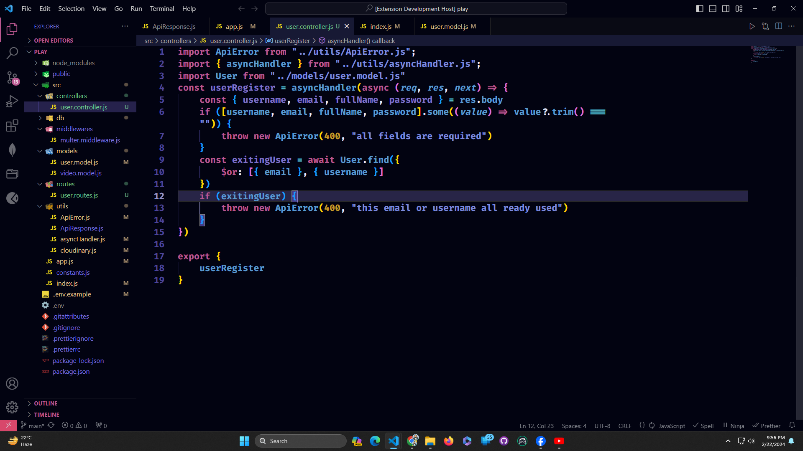
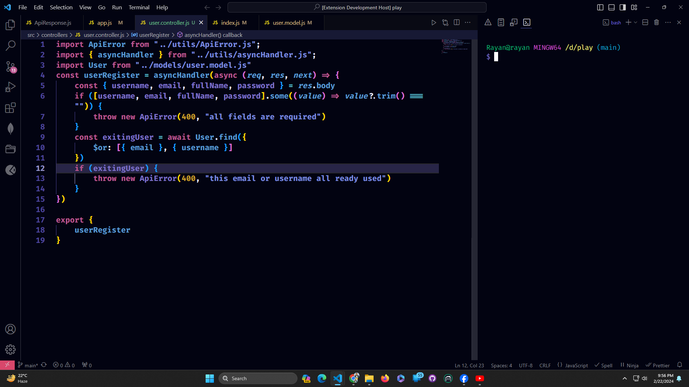

## darkLover README

Introducing "darkLover" a meticulously crafted dark theme for Visual Studio Code. Immerse yourself in the elegance of deep, contrasting hues that enhance focus and reduce eye strain during those late-night coding sessions. With carefully selected color palettes for syntax highlighting, a sleek user interface, and subtle accents, "darkLover" provides a stylish and immersive coding experience. Elevate your coding environment with this dark theme that strikes the perfect balance between aesthetics and functionality. Embrace the darkness and let your code shine with "darkLover" for Visual Studio Code.

# Screenshot 1

# Screenshot 1

- Github Link: [Rayan Hossain](https://github.com/rayan2228)
- LinkedIn Link: [Rayan Hossain](https://www.linkedin.com/in/rayan2228/)

**Enjoy!**
